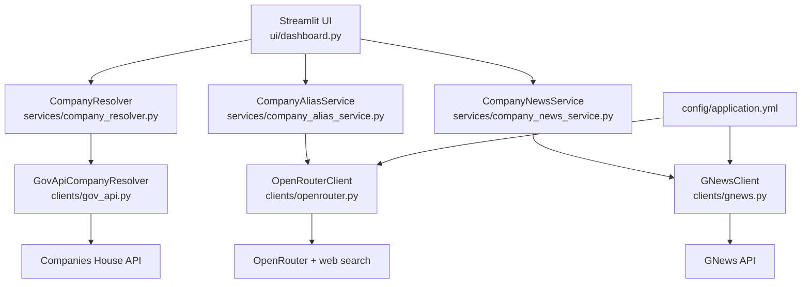

# Tunic Relic

Tunic Relic is a Streamlit prototype for investigating a company and pulling related news.

The current flow is:

1. Search for a company by name or registration number using Companies House data.
2. Use an LLM to identify the most likely consumer-facing brand for that legal entity.
3. Fetch news for that brand.

The app does **not** yet perform sentiment analysis or compute a final company risk score. Today it is focused on the data-collection pipeline needed to support that later step.

## Quick Start

### 1. Create and activate a virtual environment

Windows PowerShell:

```powershell
python -m venv .venv
.\.venv\Scripts\Activate.ps1
```

macOS/Linux:

```bash
python -m venv .venv
source .venv/bin/activate
```

### 2. Install dependencies

```bash
python -m pip install -r requirements-dev.txt
```

### 3. Set required environment variables

The app relies on three external services:

- `COMPANIES_HOUSE_API_KEY`
- `OPENROUTER_API_KEY`
- `GNEWS_API_KEY`

Windows PowerShell:

```powershell
$env:COMPANIES_HOUSE_API_KEY="your-companies-house-key"
$env:OPENROUTER_API_KEY="your-openrouter-key"
$env:GNEWS_API_KEY="your-gnews-key"
```

macOS/Linux:

```bash
export COMPANIES_HOUSE_API_KEY="your-companies-house-key"
export OPENROUTER_API_KEY="your-openrouter-key"
export GNEWS_API_KEY="your-gnews-key"
```

### 4. Run the app

```bash
python -m streamlit run main.py
```

### 5. Run the tests

```bash
python -m pytest
```

This repository has been verified locally with the project virtual environment, where `python -m pytest` passed with `52 passed`.

## Architecture

The project is intentionally simple and split into UI, services, and API clients:

- `ui/dashboard.py`: Streamlit UI and session-state flow.
- `services/company_resolver.py`: resolver contract and default resolver factory.
- `services/company_alias_service.py`: brand-identification orchestration using OpenRouter structured output.
- `services/company_news_service.py`: news lookup orchestration.
- `clients/gov_api.py`: Companies House integration.
- `clients/openrouter.py`: OpenRouter chat/structured-output client.
- `clients/gnews.py`: GNews integration.
- `config/application.yml`: base URLs and the default OpenRouter model.



### Runtime flow

1. The user searches by company name or registration number in the Streamlit dashboard.
2. Companies House data is used to resolve the legal entity and related company details.
3. The legal entity name is passed to the alias service.
4. OpenRouter is asked to return structured JSON with the likely umbrella brand and supporting evidence.
5. If a brand is found, that brand is used as the search term for GNews.
6. The UI displays the raw company data, raw brand payload, and raw news response.

## Key Design Decisions

### 1. Keep company lookup deterministic

Companies House lookup is handled separately from the LLM. That keeps the legal-entity resolution path deterministic and auditable, and it avoids using the model for data that already has a reliable source.

### 2. Use the LLM only for the missing step

The difficult part was not finding the legal entity, it was mapping that legal entity to the public-facing brand a consumer would recognize. The LLM is used only for that gap, where deterministic government data was not enough.

### 3. Require structured output and evidence

The alias service asks OpenRouter for strict JSON plus evidence. That reduces free-form guessing and makes the result easier to inspect in the UI and reason about during debugging.

### 4. Keep the system thin and synchronous

The code is deliberately small: a Streamlit UI layer, thin services, and thin API clients. That made it faster to iterate on the core idea and easier to unit test the boundaries between responsibilities.

## Trade-Offs Made

The original idea was to:

1. get company data from Companies House,
2. get relevant news for that company, and
3. use the LLM to analyse the sentiment of that news and infer risk.

In practice, Companies House gave strong legal-entity data but did not reliably provide the consumer-facing brand name needed to search for useful news coverage. Because of that, the effort shifted toward using the LLM to deterministically identify the likely brand from the legal company name.

That trade-off changed the scope of the prototype:

- it made the current version workable,
- it improved the relevance of the news search query,
- and it kept the LLM focused on a narrower, more controllable task.

The cost of that decision is that sentiment analysis and percentage-based company risk scoring are still future work rather than part of the current app.

## What I'd Do Differently With More Time and Budget

The next step would be to continue from where this prototype stops:

- sample more news articles across a wider range of sources,
- pass that broader news corpus to the LLM,
- classify which articles are positive, neutral, or negative,
- use article volume and source coverage to derive a trust score,
- use the sentiment mix to derive a risk score,
- and combine both into a percentage-based view of company risk.

That would turn the app from a brand-and-news retrieval prototype into a fuller risk-assessment tool.

## Known Limitations

- `OPENROUTER_API_KEY` and `GNEWS_API_KEY` are required at app startup because the corresponding clients are created when the dashboard is initialized.
- `COMPANIES_HOUSE_API_KEY` is required when the user actually searches for or resolves a company.
- The current UI exposes raw payloads for company details, brand identification, and news results rather than a summarized business outcome.
- News relevance still depends heavily on whether the identified brand is unique enough to produce clean search results.
- There is no sentiment analysis, trust score, or final risk score in the current implementation.

## Testing

The project includes unit tests for:

- Companies House client behavior,
- OpenRouter client behavior,
- GNews client behavior,
- brand-identification service behavior,
- news service behavior,
- resolver wiring.

Run them with:

```bash
python -m pytest
```

When using the repository's local virtual environment, this command has been verified to pass.
